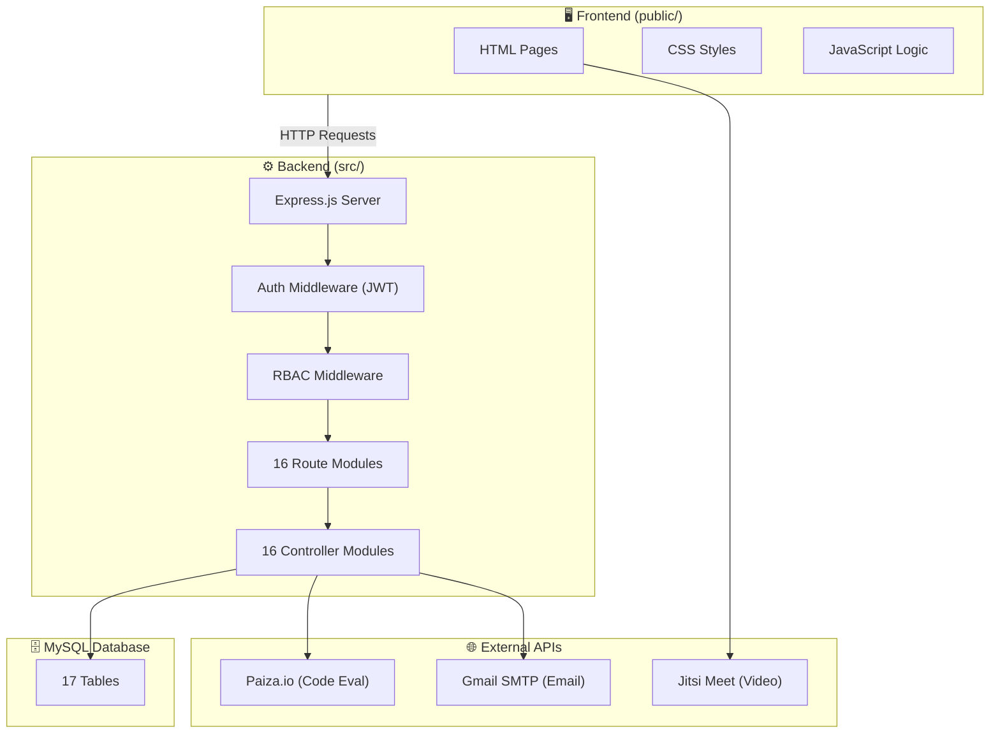
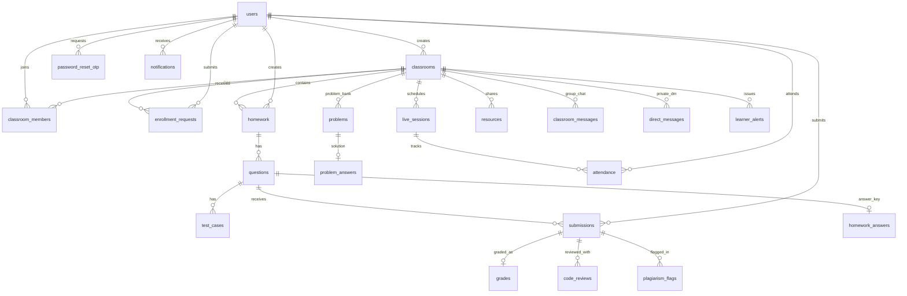

# 📚 ClassSync — Complete Project Documentation (Viva Edition)

> **DBMS Lab Project (CSE 3522) — United International University (UIU)**
> Multi-Tenant Classroom Management System REST API

---

## 📋 Table of Contents

1. [Project Overview](#1-project-overview)
2. [Technology Stack](#2-technology-stack)
3. [Architecture Diagram](#3-architecture-diagram)
4. [Complete File Structure & Breakdown](#4-complete-file-structure--breakdown)
5. [Database Schema — All 17 Tables](#5-database-schema--all-17-tables)
6. [Entity-Relationship Diagram](#6-entity-relationship-diagram)
7. [All SQL JOIN Queries Used in the Project](#7-all-sql-join-queries-used-in-the-project)
8. [Feature-wise Breakdown — Where Each Feature Lives](#8-feature-wise-breakdown--where-each-feature-lives)
9. [Authentication & Security System](#9-authentication--security-system)
10. [Role-Based Access Control (RBAC)](#10-role-based-access-control-rbac)
11. [API Endpoint Reference (All 70+ APIs)](#11-api-endpoint-reference-all-70-apis)
12. [Background Services & Automation](#12-background-services--automation)
13. [Frontend Pages Overview](#13-frontend-pages-overview)
14. [How to Run](#14-how-to-run)

---

## 1. Project Overview

**ClassSync** is a full-stack, multi-tenant classroom management system where:
- **Instructors** can create classrooms (public/private, free/paid), assign homework with coding questions, schedule live video classes (via Jitsi), grade submissions, detect plagiarism, manage resources, track attendance, issue learner alerts, and view analytics dashboards.
- **TAs (Teaching Assistants)** can assist instructors with most operations (homework creation, grading, etc.)
- **Learners** can enroll in classrooms, submit homework (text, file upload, or code), attend live sessions, view leaderboards, exchange messages, and receive real-time notifications.

The system implements a **3-tier role hierarchy** (`instructor → TA → learner`) with full RBAC enforcement on every API endpoint.

---

## 2. Technology Stack

| Layer | Technology | Purpose |
|-------|-----------|---------|
| **Backend** | Node.js + Express.js v4 | REST API server |
| **Database** | MySQL (via XAMPP) | Relational data storage |
| **DB Driver** | mysql2/promise | Async MySQL connection pooling |
| **Auth** | JWT (jsonwebtoken) + bcrypt | Token-based authentication & password hashing |
| **Email** | Nodemailer (Gmail SMTP) | OTP verification emails |
| **Code Execution** | Paiza.io API | Remote code evaluation engine (Python, C++, Java, JS, etc.) |
| **Video Calls** | Jitsi Meet (embedded) | Live classroom video sessions |
| **Frontend** | Vanilla HTML + CSS + JavaScript | Static single-page-like UI served via Express |
| **File Upload** | Express static + multer-like handling | File submission management |

### Key Dependencies ([package.json](file:///e:/ClassSync/package.json)):
```json
{
  "bcrypt": "^6.0.0",
  "cors": "^2.8.5",
  "dotenv": "^16.4.5",
  "express": "^4.19.2",
  "jsonwebtoken": "^9.0.3",
  "mysql2": "^3.9.7",
  "nodemailer": "^10.0.1"
}
```

---

## 3. Architecture Diagram



---

## 4. Complete File Structure & Breakdown

```
ClassSync/
├── .env                          # Environment config (DB credentials, JWT secret, email config)
├── .env.example                  # Template for .env setup
├── package.json                  # NPM dependencies & scripts
├── schema.sql                    # ✅ Complete MySQL schema (17 tables, all FKs, indexes)
├── seed.sql                      # Sample demo data for testing
├── classsync_db.sql              # Full database dump with data
│
├── src/                          # ===== BACKEND SOURCE CODE =====
│   ├── server.js                 # 🚀 Main entry point — Express setup, route mounting, background jobs
│   │
│   ├── config/
│   │   └── db.js                 # MySQL connection pool (mysql2/promise)
│   │
│   ├── middleware/
│   │   ├── auth.js               # JWT token verification (verifyToken, optionalToken)
│   │   └── rbac.js               # Role-Based Access Control middleware factory
│   │
│   ├── controllers/              # ===== BUSINESS LOGIC (16 Controllers) =====
│   │   ├── authController.js     # Register, Login, OTP verify, Forgot/Reset Password
│   │   ├── classroomController.js# Create/Join/Leave classroom, enrollment requests, member mgmt
│   │   ├── homeworkController.js # CRUD homework sets, questions, answer keys, reorder
│   │   ├── submissionController.js# Submit solutions, submission matrix, plagiarism refresh
│   │   ├── gradeController.js    # Manual grading, code review comments, consolidated view
│   │   ├── autoEvalController.js # Test cases CRUD, auto-evaluation via Paiza, grade approval
│   │   ├── liveSessionController.js# Schedule/Start/End sessions, attendance recording
│   │   ├── analyticsController.js# Leaderboard, class health dashboard, at-risk detection
│   │   ├── plagiarismController.js# Similarity detection, scan trigger, flag management
│   │   ├── messageController.js  # Group chat, DM contacts, direct messages, unread count
│   │   ├── notificationController.js# List/Mark-read notifications
│   │   ├── alertController.js    # Yellow/Red learner alerts, resolve/clear alerts
│   │   ├── resourceController.js # Share/approve/edit/delete learning resources
│   │   ├── problemController.js  # Problem bank CRUD, solutions
│   │   ├── uploadController.js   # File upload handling
│   │   └── userController.js     # User profile management
│   │
│   ├── routes/                   # ===== API ROUTE DEFINITIONS (16 Route Files) =====
│   │   ├── authRoutes.js         # /api/auth/*
│   │   ├── classroomRoutes.js    # /api/classrooms/*, /api/courses/*
│   │   ├── homeworkRoutes.js     # /api/classrooms/:id/homework, /api/homework/:id
│   │   ├── submissionRoutes.js   # /api/questions/:id/submit, /api/homework/:id/matrix
│   │   ├── gradeRoutes.js        # /api/submissions/:id/grade, /api/code-reviews/*
│   │   ├── autoEvalRoutes.js     # /api/questions/:id/test-cases, /api/submissions/:id/auto-evaluate
│   │   ├── liveSessionRoutes.js  # /api/classrooms/:id/live-sessions
│   │   ├── analyticsRoutes.js    # /api/classrooms/:id/leaderboard, /api/classrooms/:id/health
│   │   ├── plagiarismRoutes.js   # /api/classrooms/:id/plagiarism-*
│   │   ├── messageRoutes.js      # /api/classrooms/:id/messages, /api/classrooms/:id/dm/*
│   │   ├── notificationRoutes.js # /api/notifications
│   │   ├── alertRoutes.js        # /api/classrooms/:id/alerts
│   │   ├── resourceRoutes.js     # /api/classrooms/:id/resources
│   │   ├── problemRoutes.js      # /api/classrooms/:id/problems
│   │   ├── uploadRoutes.js       # /api/upload
│   │   └── userRoutes.js         # /api/users/*
│   │
│   └── utils/                    # ===== UTILITY MODULES =====
│       ├── mailer.js             # Gmail SMTP transporter for OTP emails
│       ├── notificationHelper.js # createNotification() helper for in-app notifications
│       ├── pistonApi.js          # Paiza.io code execution integration (9 languages)
│       └── scheduledSessionChecker.js # Background job: auto-start scheduled live sessions
│
├── public/                       # ===== FRONTEND (Static Served) =====
│   ├── index.html                # Dashboard / Home page (after login)
│   ├── login.html                # Login page
│   ├── register.html             # Registration page
│   ├── verify-otp.html           # OTP verification page
│   ├── forgot-password.html      # Forgot password form
│   ├── reset-password.html       # Password reset form
│   ├── classroom.html            # Classroom detail page (tabbed: HW, sessions, members, etc.)
│   ├── homework.html             # Homework detail & submission page
│   ├── problems.html             # Problem bank page
│   ├── leaderboard.html          # Leaderboard / Analytics page
│   ├── live.html                 # Live session (Jitsi embed) page
│   ├── css/
│   │   └── style.css             # Complete application stylesheet
│   ├── js/
│   │   ├── api.js                # API client wrapper (fetch with auth headers)
│   │   ├── navbar.js             # Navigation bar component (notifications, alerts)
│   │   ├── index.js              # Dashboard logic (classroom list, course browse, join)
│   │   ├── classroom.js          # Classroom page logic (tabs, members, settings, matrix)
│   │   ├── homework.js           # Homework page logic (questions, submit, grade, code editor)
│   │   ├── problems.js           # Problem bank logic
│   │   ├── leaderboard.js        # Leaderboard rendering
│   │   ├── live.js               # Jitsi video integration
│   │   ├── login.js              # Login form handler
│   │   ├── register.js           # Register form handler
│   │   ├── verify-otp.js         # OTP verification handler
│   │   ├── forgot-password.js    # Forgot password handler
│   │   └── reset-password.js     # Reset password handler
│   └── uploads/                  # Uploaded files directory
│
└── scripts/                      # ===== TEST & UTILITY SCRIPTS =====
    ├── init_db.js                # Database initialization script
    ├── import_db.js              # Database import from SQL dump
    ├── seed_password_hashes.js   # Generate bcrypt hashes for seed data
    └── test_*.js                 # 17 test scripts for various features
```

---

## 5. Database Schema — All 29 Tables

> **Schema file**: [schema.sql](file:///e:/ClassSync/schema.sql)

### 5.1 Table Overview

| # | Table Name | Purpose | Key Columns |
|---|-----------|---------|-------------|
| 1 | `users` | All registered users | `user_id` PK, email, password_hash, profile_picture_url, bio, social links |
| 2 | `password_reset_otp` | OTP codes for registration & password reset | `otp_id` PK, user_id FK, otp_code, otp_purpose (ENUM) |
| 3 | `classrooms` | Classroom/course definitions | `classroom_id` PK, creator_id FK, room_number (UNIQUE), visibility, is_paid, price |
| 4 | `classroom_members` | User-to-classroom membership + role | `member_id` PK, user_id FK, classroom_id FK, role (ENUM: instructor/TA/learner) |
| 5 | `enrollment_requests` | Paid course enrollment payment requests | `request_id` PK, payment_method, transaction_id, status (ENUM) |
| 6 | `classroom_messages` | Group chat messages in a classroom | `message_id` PK, classroom_id FK, sender_id FK |
| 7 | `direct_messages` | Private DMs between members (scoped to classroom) | `message_id` PK, sender_id FK, recipient_id FK, is_read |
| 8 | `homework` | Homework sets (assignments) | `homework_id` PK, classroom_id FK, deadline, is_published |
| 9 | `questions` | Questions within a homework set | `question_id` PK, homework_id FK, is_coding_question, coding_language |
| 10 | `test_cases` | Auto-evaluation test cases for coding questions | `test_case_id` PK, question_id FK, input_data, expected_output, is_hidden |
| 11 | `submissions` | Student homework submissions | `submission_id` PK, question_id FK, learner_id FK, code_hash, is_late, auto_eval_* |
| 12 | `grades` | Manual and auto grades with approval workflow | `grade_id` PK, submission_id FK (UNIQUE), score, approval_status (ENUM) |
| 13 | `code_reviews` | Inline code review comments (line-based) | `review_id` PK, submission_id FK, line_start, line_end |
| 14 | `homework_answers` | Instructor answer keys for questions | `answer_id` PK, question_id FK (UNIQUE), answer_text |
| 15 | `problems` | Problem bank (categorized practice problems) | `problem_id` PK, classroom_id FK, category, difficulty (ENUM) |
| 16 | `problem_answers` | Solutions for problem bank items | `problem_answer_id` PK, problem_id FK (UNIQUE) |
| 17 | `resources` | Shared learning resources with approval | `resource_id` PK, classroom_id FK, is_approved, approved_by FK |
| 18 | `notifications` | In-app notifications for all users | `notification_id` PK, user_id FK, notification_type, is_read |
| 19 | `learner_alerts` | Yellow/Red warning alerts for at-risk learners | `alert_id` PK, alert_type (ENUM: yellow/red), is_resolved |
| 20 | `live_sessions` | Scheduled/active live video class sessions | `session_id` PK, jitsi_room_id (UNIQUE), started_at, ended_at |
| 21 | `attendance` | Learner attendance records for live sessions | `attendance_id` PK, session_id FK, duration_minutes, instructor_override |
| 22 | `plagiarism_flags` | Plagiarism similarity detection results | `flag_id` PK, submission_id_1 FK, submission_id_2 FK, similarity_score |
| 23 | `user_todos` | Personal task management | `todo_id` PK, user_id FK, title, priority, due_date, completed |
| 24 | `quizzes` | Quizzes & Exams definition | `quiz_id` PK, classroom_id FK, created_by FK, quiz_type (ENUM: live/flexible), duration_minutes |
| 25 | `quiz_questions` | Questions inside a quiz | `question_id` PK, quiz_id FK, question_type (ENUM: mcq/true_false/short_answer/coding), points |
| 26 | `quiz_options` | MCQ options for quiz questions | `option_id` PK, question_id FK, option_text, is_correct |
| 27 | `quiz_test_cases` | Test cases for coding quiz questions | `test_case_id` PK, question_id FK, input_data, expected_output, is_hidden |
| 28 | `quiz_attempts` | Student quiz attempt instances | `attempt_id` PK, quiz_id FK, learner_id FK, started_at, status (ENUM: in_progress/submitted/time_expired) |
| 29 | `quiz_answers` | Student answers submitted per quiz question | `answer_id` PK, attempt_id FK, question_id FK, selected_option_id, answer_text, coding_language |


### 5.2 Key Constraints & Indexes

```sql
-- UNIQUE composite indexes (no duplicates)
UNIQUE INDEX (user_id, classroom_id)       -- on classroom_members
UNIQUE INDEX (question_id, learner_id)     -- on submissions (1 submission per question per learner)
UNIQUE INDEX (session_id, learner_id)      -- on attendance (1 attendance per session per learner)
UNIQUE INDEX (submission_id_1, submission_id_2) -- on plagiarism_flags

-- CHECK constraint
CHECK (submission_id_1 < submission_id_2)  -- ensures ordered pair in plagiarism_flags
```

### 5.3 ENUM Types Used

| Table | Column | Values |
|-------|--------|--------|
| `password_reset_otp` | otp_purpose | `'registration'`, `'password_reset'` |
| `classrooms` | visibility | `'public'`, `'private'` |
| `classroom_members` | role | `'instructor'`, `'TA'`, `'learner'` |
| `enrollment_requests` | status | `'pending'`, `'approved'`, `'rejected'` |
| `submissions` | submission_type | `'text'`, `'link'`, `'pdf'`, `'docx'`, `'pptx'` |
| `submissions` | auto_eval_status | `'none'`, `'pending'`, `'done'`, `'error'` |
| `grades` | approval_status | `'none'`, `'auto_pending'`, `'approved'`, `'manual'` |
| `problems` | difficulty | `'easy'`, `'medium'`, `'hard'` |
| `learner_alerts` | alert_type | `'yellow'`, `'red'` |

---

## 6. Entity-Relationship Diagram



---

## 7. All SQL JOIN Queries Used in the Project

> [!IMPORTANT]
> This section lists **every JOIN query** used across all controllers — organized by feature module. This is a core viva topic for the DBMS Lab.

---

### 7.1 Authentication — [authController.js](file:///e:/ClassSync/src/controllers/authController.js)

**No JOIN queries** — Authentication only queries the `users` and `password_reset_otp` tables directly.

```sql
-- Login: simple WHERE query
SELECT user_id, email, password_hash, full_name, profile_picture_url, is_verified, is_active
FROM users WHERE email = ?
```

---

### 7.2 Classroom Management — [classroomController.js](file:///e:/ClassSync/src/controllers/classroomController.js)

#### JOIN 1: Public Course Search (classrooms + users + subquery)
```sql
SELECT c.classroom_id, c.classroom_name, c.description, c.cover_photo_url,
       c.visibility, c.is_paid, c.price, c.created_at,
       u.full_name AS instructor_name, u.email AS instructor_email,
       u.profile_picture_url AS instructor_avatar,
       (SELECT COUNT(*) FROM classroom_members cm 
        WHERE cm.classroom_id = c.classroom_id AND cm.is_active = true) AS member_count
FROM classrooms c
JOIN users u ON c.creator_id = u.user_id
WHERE c.visibility = 'public' AND c.is_active = true
```
> **JOIN type**: `INNER JOIN` — classrooms → users (to get instructor name)
> **Subquery**: Correlated scalar subquery to count active members

#### JOIN 2: Get User's Classrooms (classroom_members + classrooms + users + subquery)
```sql
SELECT c.classroom_id, c.classroom_name, c.description, c.room_number, c.room_password,
       c.visibility, c.is_paid, c.price, c.cover_photo_url,
       c.creator_id, u.full_name AS creator_name, cm.role, cm.joined_at,
       (SELECT la.alert_type FROM learner_alerts la 
        WHERE la.classroom_id = c.classroom_id AND la.learner_id = ? 
        AND la.is_resolved = false 
        ORDER BY la.created_at DESC LIMIT 1) AS active_alert_type
FROM classroom_members cm
JOIN classrooms c ON cm.classroom_id = c.classroom_id
JOIN users u ON c.creator_id = u.user_id
WHERE cm.user_id = ? AND cm.is_active = true AND c.is_active = true
ORDER BY cm.joined_at DESC
```
> **JOIN type**: Double `INNER JOIN` — members → classrooms → users
> **Subquery**: Correlated subquery to get active alert type for each classroom

#### JOIN 3: Classroom Details (classrooms + users)
```sql
SELECT c.classroom_id, c.classroom_name, c.description, c.room_number, c.room_password,
       c.visibility, c.is_paid, c.price, c.cover_photo_url, c.attendance_threshold_percent,
       c.creator_id, u.full_name AS creator_name, u.email AS creator_email, c.created_at
FROM classrooms c
JOIN users u ON c.creator_id = u.user_id
WHERE c.classroom_id = ? AND c.is_active = true
```

#### JOIN 4: Members List (classroom_members + users)
```sql
SELECT cm.member_id, cm.user_id, u.full_name, u.email, u.profile_picture_url, cm.role, cm.joined_at
FROM classroom_members cm
JOIN users u ON cm.user_id = u.user_id
WHERE cm.classroom_id = ? AND cm.is_active = true
ORDER BY CASE cm.role WHEN 'instructor' THEN 1 WHEN 'TA' THEN 2 ELSE 3 END, u.full_name ASC
```
> **Interesting**: Uses `CASE WHEN` in `ORDER BY` to sort by role hierarchy

#### JOIN 5: Enrollment Requests (enrollment_requests + users + users self-join)
```sql
SELECT er.request_id, er.classroom_id, er.user_id, er.payment_method,
       er.payer_phone_number, er.transaction_id, er.status, er.requested_at,
       er.reviewed_at, u.full_name AS student_name, u.email AS student_email,
       u.profile_picture_url AS student_avatar, r.full_name AS reviewer_name
FROM enrollment_requests er
JOIN users u ON er.user_id = u.user_id
LEFT JOIN users r ON er.reviewed_by = r.user_id
WHERE er.classroom_id = ?
ORDER BY CASE er.status WHEN 'pending' THEN 1 ELSE 2 END, er.requested_at DESC
```
> **JOIN types**: `INNER JOIN` + `LEFT JOIN` (self-join on users table — once for student, once for reviewer)
> **Why LEFT JOIN?**: reviewed_by can be NULL (pending requests)

#### JOIN 6: Approve Enrollment (enrollment_requests + classrooms)
```sql
SELECT er.request_id, er.classroom_id, er.user_id, er.status, c.classroom_name
FROM enrollment_requests er
JOIN classrooms c ON er.classroom_id = c.classroom_id
WHERE er.request_id = ?
```

#### JOIN 7: Student Info with Attendance Stats (classroom_members + users + attendance + live_sessions)
```sql
-- Get learners
SELECT cm.member_id, cm.user_id, cm.role, cm.joined_at,
       u.full_name, u.email, u.phone_number
FROM classroom_members cm
JOIN users u ON cm.user_id = u.user_id
WHERE cm.classroom_id = ? AND cm.role = 'learner' AND cm.is_active = true

-- Per-learner attendance calculation
SELECT COUNT(DISTINCT a.session_id) as present_sessions
FROM attendance a
JOIN live_sessions ls ON a.session_id = ls.session_id
WHERE ls.classroom_id = ? AND ls.is_active = true AND a.learner_id = ?
  AND (a.is_present = true OR (a.instructor_override = true AND a.override_present = true))
```
> **Interesting**: Uses `DISTINCT` and compound boolean conditions for attendance with override logic

---

### 7.3 Homework Management — [homeworkController.js](file:///e:/ClassSync/src/controllers/homeworkController.js)

#### JOIN 8: List Classroom Homework (homework + users + 2 subqueries)
```sql
SELECT h.homework_id, h.classroom_id, h.title, h.description, h.total_points, h.deadline,
       h.created_by, h.is_published, h.published_at, h.created_at,
       u.full_name AS creator_name,
       (SELECT COUNT(*) FROM questions q WHERE q.homework_id = h.homework_id) AS question_count,
       (SELECT COUNT(DISTINCT s.question_id) FROM submissions s 
        JOIN questions q ON s.question_id = q.question_id 
        WHERE q.homework_id = h.homework_id AND s.learner_id = ?) AS submitted_count
FROM homework h
JOIN users u ON h.created_by = u.user_id
WHERE h.classroom_id = ? AND h.is_active = true
```
> **Subquery with JOIN**: The `submitted_count` subquery itself contains a JOIN between `submissions` and `questions`

#### JOIN 9: Homework Detail (homework + classrooms + users)
```sql
SELECT h.*, c.classroom_name, u.full_name AS creator_name
FROM homework h
JOIN classrooms c ON h.classroom_id = c.classroom_id
JOIN users u ON h.created_by = u.user_id
WHERE h.homework_id = ? AND h.is_active = true
```
> **Triple INNER JOIN**: homework → classrooms → users

#### JOIN 10: Questions with Submissions & Grades (questions + submissions + grades — LEFT JOINs)
```sql
SELECT q.*,
       s.submission_id, s.submission_type, s.submitted_at, s.is_late, s.penalty_applied,
       s.code_content, s.file_url, s.auto_eval_status, s.auto_eval_score, s.auto_eval_results,
       g.grade_id, g.score, g.feedback, g.is_draft, g.graded_at, g.status
FROM questions q
LEFT JOIN submissions s ON q.question_id = s.question_id AND s.learner_id = ?
LEFT JOIN grades g ON s.submission_id = g.submission_id
WHERE q.homework_id = ?
ORDER BY q.order_number ASC, q.question_id ASC
```
> **Double LEFT JOIN**: questions → submissions → grades
> **Why LEFT JOIN?**: Not every question has a submission, not every submission has a grade
> **JOIN condition**: `s.learner_id = ?` filters to current user's submissions only

#### JOIN 11: Update Question Access Check (questions + homework)
```sql
SELECT q.homework_id, h.classroom_id, q.is_coding_question
FROM questions q
JOIN homework h ON q.homework_id = h.homework_id
WHERE q.question_id = ? AND h.is_active = true
```

#### JOIN 12: Question Answer Key (homework_answers + users)
```sql
SELECT ha.*, u.full_name AS instructor_name
FROM homework_answers ha
JOIN users u ON ha.instructor_id = u.user_id
WHERE ha.question_id = ?
```

---

### 7.4 Submission & Grading — [submissionController.js](file:///e:/ClassSync/src/controllers/submissionController.js), [gradeController.js](file:///e:/ClassSync/src/controllers/gradeController.js)

#### JOIN 13: Submit — Get Question & Homework Deadline (questions + homework)
```sql
SELECT q.question_id, q.homework_id, h.deadline, h.classroom_id
FROM questions q
JOIN homework h ON q.homework_id = h.homework_id
WHERE q.question_id = ?
```

#### JOIN 14: Check Existing Submission & Grade (submissions + grades — LEFT JOIN)
```sql
SELECT s.submission_id, g.grade_id
FROM submissions s
LEFT JOIN grades g ON s.submission_id = g.submission_id
WHERE s.question_id = ? AND s.learner_id = ?
```
> **Purpose**: Prevents re-submission if already graded

#### JOIN 15: Submission Matrix — Learners List (classroom_members + users)
```sql
SELECT u.user_id, u.full_name, u.email
FROM classroom_members cm
JOIN users u ON cm.user_id = u.user_id
WHERE cm.classroom_id = ? AND cm.role IN ('learner', 'TA') AND cm.is_active = true
ORDER BY u.full_name ASC
```

#### JOIN 16: Submission Matrix — All Submissions + Grades (submissions + questions + grades — LEFT JOIN)
```sql
SELECT s.submission_id, s.question_id, s.learner_id, s.submitted_at, s.is_late, s.penalty_applied,
       g.grade_id, g.score, g.feedback, g.is_draft
FROM submissions s
JOIN questions q ON s.question_id = q.question_id
LEFT JOIN grades g ON s.submission_id = g.submission_id
WHERE q.homework_id = ?
```

#### JOIN 17: Streak Calculation (submissions + questions + grades — Triple JOIN)
```sql
SELECT SUM(g.score) AS earned_pts
FROM submissions s
JOIN questions q ON s.question_id = q.question_id
JOIN grades g ON s.submission_id = g.submission_id
WHERE q.homework_id = ? AND s.learner_id = ? AND g.is_draft = false
```
> **Triple INNER JOIN**: submissions → questions → grades

#### JOIN 18: Full Classroom Matrix (submissions + questions + homework + grades — Quadruple JOIN)
```sql
SELECT s.submission_id, s.question_id, s.learner_id, s.submitted_at, s.is_late, s.penalty_applied,
       g.grade_id, g.score, g.feedback, g.is_draft, g.status
FROM submissions s
JOIN questions q ON s.question_id = q.question_id
JOIN homework h ON q.homework_id = h.homework_id
LEFT JOIN grades g ON s.submission_id = g.submission_id
WHERE h.classroom_id = ?
```
> **4-way JOIN**: submissions → questions → homework → grades
> **This is the most complex query** — fetches ALL submissions across ALL homeworks in a classroom

#### JOIN 19: Question Submissions List (submissions + users + grades + subquery)
```sql
SELECT s.submission_id, s.question_id, s.learner_id, s.submission_type,
       u.full_name AS learner_name, u.email AS learner_email,
       s.code_hash, s.code_content, s.file_url, s.submitted_at, s.is_late,
       s.minutes_late, s.penalty_applied,
       g.grade_id, g.score, g.feedback, g.is_draft, g.graded_at,
       (SELECT COUNT(*) FROM code_reviews cr WHERE cr.submission_id = s.submission_id) AS review_count
FROM submissions s
JOIN users u ON s.learner_id = u.user_id
LEFT JOIN grades g ON s.submission_id = g.submission_id
WHERE s.question_id = ?
```
> **Mixed JOINs + Subquery**: INNER JOIN (users), LEFT JOIN (grades), scalar subquery (code_reviews count)

#### JOIN 20: Submission Detail View (submissions + users + questions + grades)
```sql
SELECT s.submission_id, s.question_id, s.learner_id, s.submission_type,
       u.full_name AS learner_name, u.email AS learner_email,
       s.code_content, s.file_url, s.submitted_at, s.is_late, s.penalty_applied,
       s.minutes_late, s.is_final,
       g.score, g.feedback, g.grade_id, g.status,
       q.points AS max_score
FROM submissions s
JOIN users u ON s.learner_id = u.user_id
JOIN questions q ON s.question_id = q.question_id
LEFT JOIN grades g ON s.submission_id = g.submission_id
WHERE s.submission_id = ?
```

#### JOIN 21: Grade — Fetch Submission Context (submissions + questions + homework)
```sql
SELECT s.learner_id, s.question_id, q.question_text, q.homework_id, h.title AS homework_title
FROM submissions s
JOIN questions q ON s.question_id = q.question_id
JOIN homework h ON q.homework_id = h.homework_id
WHERE s.submission_id = ?
```

#### JOIN 22: Code Reviews List (code_reviews + users)
```sql
SELECT cr.*, u.full_name AS reviewer_name, u.profile_picture_url AS reviewer_avatar
FROM code_reviews cr
JOIN users u ON cr.reviewer_id = u.user_id
WHERE cr.submission_id = ?
ORDER BY cr.line_start ASC, cr.created_at ASC
```

#### JOIN 23: Consolidated Gradings View — **BIGGEST JOIN** (submissions + questions + homework + users + grades)
```sql
SELECT 
    s.submission_id,
    q.homework_id, h.title AS homework_title,
    s.question_id, q.question_text AS question_title, q.points AS max_score,
    s.learner_id, u.full_name AS learner_name, u.email AS learner_email,
    s.submitted_at, s.is_late, s.submission_type,
    g.score, g.is_draft, g.status,
    CASE WHEN g.grade_id IS NOT NULL THEN true ELSE false END AS is_graded
FROM submissions s
JOIN questions q ON s.question_id = q.question_id
JOIN homework h ON q.homework_id = h.homework_id
JOIN users u ON s.learner_id = u.user_id
LEFT JOIN grades g ON s.submission_id = g.submission_id
WHERE h.classroom_id = ?
```
> **5-way JOIN** — This is the **largest multi-table JOIN** in the entire project
> Joins: `submissions` → `questions` → `homework` → `users` + LEFT JOIN `grades`
> Uses `CASE WHEN` expression for computed `is_graded` boolean

---

### 7.5 Plagiarism Detection — [plagiarismController.js](file:///e:/ClassSync/src/controllers/plagiarismController.js)

#### JOIN 24: Get Submissions for Plagiarism Scan (submissions + questions + homework)
```sql
SELECT s.submission_id, s.question_id, s.learner_id, s.code_hash, s.code_content, q.homework_id
FROM submissions s
JOIN questions q ON s.question_id = q.question_id
JOIN homework h ON q.homework_id = h.homework_id
WHERE h.classroom_id = ? AND h.homework_id = ?
  AND h.is_active = true
  AND s.submission_type = 'text'
  AND s.code_content IS NOT NULL AND TRIM(s.code_content) != ''
```

#### JOIN 25: Delete Existing Plagiarism Flags (plagiarism_flags + submissions + questions + homework — DELETE with JOINs)
```sql
DELETE pf
FROM plagiarism_flags pf
JOIN submissions s1 ON pf.submission_id_1 = s1.submission_id
JOIN questions q ON s1.question_id = q.question_id
JOIN homework h ON q.homework_id = h.homework_id
WHERE h.classroom_id = ? AND h.homework_id = ?
```
> **DELETE with triple JOIN** — Advanced SQL pattern

#### JOIN 26: Plagiarism Flags Display — **MOST COMPLEX JOIN** (plagiarism_flags + 2x submissions + 2x users + questions + homework)
```sql
SELECT pf.*,
       s1.code_content AS content_1, u1.full_name AS learner_1_name, u1.email AS learner_1_email,
       s2.code_content AS content_2, u2.full_name AS learner_2_name, u2.email AS learner_2_email,
       q.question_text, h.title AS homework_title
FROM plagiarism_flags pf
JOIN submissions s1 ON pf.submission_id_1 = s1.submission_id
JOIN submissions s2 ON pf.submission_id_2 = s2.submission_id
JOIN users u1 ON s1.learner_id = u1.user_id
JOIN users u2 ON s2.learner_id = u2.user_id
JOIN questions q ON s1.question_id = q.question_id
JOIN homework h ON q.homework_id = h.homework_id
WHERE h.classroom_id = ? AND h.is_active = true
ORDER BY pf.similarity_score DESC
```
> **7-way JOIN** — This is the **absolute largest JOIN** in the project!
> Self-joins `submissions` table twice (s1, s2) and `users` table twice (u1, u2)

---

### 7.6 Live Sessions & Attendance — [liveSessionController.js](file:///e:/ClassSync/src/controllers/liveSessionController.js)

#### JOIN 27: List Live Sessions (live_sessions + users)
```sql
SELECT ls.*, u.full_name AS creator_name
FROM live_sessions ls
JOIN users u ON ls.created_by = u.user_id
WHERE ls.classroom_id = ? AND ls.is_active = true
```

#### JOIN 28: Session Detail (live_sessions + classrooms + users)
```sql
SELECT ls.*, c.classroom_name, u.full_name AS creator_name
FROM live_sessions ls
JOIN classrooms c ON ls.classroom_id = c.classroom_id
JOIN users u ON ls.created_by = u.user_id
WHERE ls.session_id = ? AND ls.is_active = true
```

#### JOIN 29: Attendance List (attendance + users)
```sql
SELECT a.*, u.full_name AS learner_name, u.email AS learner_email
FROM attendance a
JOIN users u ON a.learner_id = u.user_id
WHERE a.session_id = ?
ORDER BY u.full_name ASC
```

#### JOIN 30: Attendance Threshold Check (live_sessions + classrooms)
```sql
SELECT ls.expected_duration, c.attendance_threshold_percent
FROM live_sessions ls
JOIN classrooms c ON ls.classroom_id = c.classroom_id
WHERE ls.session_id = ?
```

#### JOIN 31: Override — Get Classroom from Attendance (attendance + live_sessions)
```sql
SELECT a.session_id, ls.classroom_id
FROM attendance a
JOIN live_sessions ls ON a.session_id = ls.session_id
WHERE a.attendance_id = ?
```

#### JOIN 32: Active Live Sessions for Current User (live_sessions + classrooms + classroom_members — Triple JOIN)
```sql
SELECT ls.session_id, ls.session_title, ls.jitsi_room_id, ls.started_at,
       c.classroom_id, c.classroom_name
FROM live_sessions ls
JOIN classrooms c ON ls.classroom_id = c.classroom_id
JOIN classroom_members cm ON c.classroom_id = cm.classroom_id
WHERE cm.user_id = ? AND cm.is_active = true
  AND ls.is_active = true AND ls.ended_at IS NULL AND ls.started_at IS NOT NULL
```

---

### 7.7 Analytics & Leaderboard — [analyticsController.js](file:///e:/ClassSync/src/controllers/analyticsController.js)

#### JOIN 33: Leaderboard Score Calculation (submissions + questions + homework + grades — Quadruple JOIN with aggregation)
```sql
SELECT SUM(g.score) AS total_score, COUNT(DISTINCT s.question_id) AS submitted_questions
FROM submissions s
JOIN questions q ON s.question_id = q.question_id
JOIN homework h ON q.homework_id = h.homework_id
JOIN grades g ON s.submission_id = g.submission_id
WHERE h.classroom_id = ? AND s.learner_id = ? AND g.is_draft = false
```
> **4-way INNER JOIN with SUM() and COUNT(DISTINCT)** — aggregate functions

#### JOIN 34: Class Health — Submission Stats (submissions + questions + homework)
```sql
SELECT COUNT(*) AS total_submissions,
       SUM(CASE WHEN s.is_late = true THEN 1 ELSE 0 END) AS late_submissions
FROM submissions s
JOIN questions q ON s.question_id = q.question_id
JOIN homework h ON q.homework_id = h.homework_id
WHERE h.classroom_id = ?
```

#### JOIN 35: Attendance Rate (attendance + live_sessions)
```sql
SELECT COUNT(*) AS total_records,
       SUM(CASE WHEN a.is_present = true OR 
           (a.instructor_override = true AND a.override_present = true) THEN 1 ELSE 0 END) AS present_records
FROM attendance a
JOIN live_sessions ls ON a.session_id = ls.session_id
WHERE ls.classroom_id = ?
```

#### JOIN 36: At-Risk Learners (classroom_members + users + subqueries)
```sql
SELECT u.user_id, u.full_name, u.email, u.profile_picture_url,
       (SELECT COUNT(*) FROM learner_alerts la 
        WHERE la.learner_id = u.user_id AND la.classroom_id = ? AND la.is_resolved = false) AS unresolved_alerts,
       (SELECT alert_type FROM learner_alerts la 
        WHERE la.learner_id = u.user_id AND la.classroom_id = ? AND la.is_resolved = false 
        ORDER BY alert_id DESC LIMIT 1) AS highest_alert
FROM classroom_members cm
JOIN users u ON cm.user_id = u.user_id
WHERE cm.classroom_id = ? AND cm.role = 'learner' AND cm.is_active = true
```

#### JOIN 37: Per-learner Grade Average (grades + submissions + questions + homework)
```sql
SELECT AVG(g.score) AS avg_score
FROM grades g
JOIN submissions s ON g.submission_id = s.submission_id
JOIN questions q ON s.question_id = q.question_id
JOIN homework h ON q.homework_id = h.homework_id
WHERE h.classroom_id = ? AND s.learner_id = ? AND g.is_draft = false
```

---

### 7.8 Messaging — [messageController.js](file:///e:/ClassSync/src/controllers/messageController.js)

#### JOIN 38: Group Chat Messages (classroom_messages + users + classroom_members — LEFT JOIN for role)
```sql
SELECT m.message_id, m.classroom_id, m.sender_id, m.message_text, m.sent_at,
       u.full_name AS sender_name, cm.role AS sender_role
FROM classroom_messages m
JOIN users u ON m.sender_id = u.user_id
LEFT JOIN classroom_members cm ON m.sender_id = cm.user_id AND cm.classroom_id = m.classroom_id
WHERE m.classroom_id = ?
ORDER BY m.sent_at DESC LIMIT 100
```
> **Mixed**: INNER JOIN (users) + LEFT JOIN (classroom_members — user might have left)

#### JOIN 39: DM Contacts with Unread Count (classroom_members + users + subquery)
```sql
SELECT u.user_id, u.full_name, u.email, cm.role,
       (SELECT COUNT(*) FROM direct_messages dm 
        WHERE dm.classroom_id = cm.classroom_id AND dm.sender_id = u.user_id 
        AND dm.recipient_id = ? AND dm.is_read = false) AS unread_count
FROM classroom_members cm
JOIN users u ON cm.user_id = u.user_id
WHERE cm.classroom_id = ? AND cm.role IN ('instructor', 'TA') AND cm.is_active = true
```

#### JOIN 40: Direct Messages (direct_messages + users)
```sql
SELECT dm.message_id, dm.classroom_id, dm.sender_id, dm.recipient_id, 
       dm.message_text, dm.sent_at, dm.is_read,
       u.full_name AS sender_name
FROM direct_messages dm
JOIN users u ON dm.sender_id = u.user_id
WHERE dm.classroom_id = ? 
  AND ((dm.sender_id = ? AND dm.recipient_id = ?) OR (dm.sender_id = ? AND dm.recipient_id = ?))
ORDER BY dm.sent_at DESC LIMIT 50
```

---

### 7.9 Alerts — [alertController.js](file:///e:/ClassSync/src/controllers/alertController.js)

#### JOIN 41: Classroom Alerts List (learner_alerts + users x3 — Triple self-join)
```sql
SELECT la.*, l.full_name AS learner_name, l.email AS learner_email, 
       inst.full_name AS instructor_name, res.full_name AS resolver_name
FROM learner_alerts la
JOIN users l ON la.learner_id = l.user_id
JOIN users inst ON la.instructor_id = inst.user_id
LEFT JOIN users res ON la.resolved_by = res.user_id
WHERE la.classroom_id = ?
```
> **Triple self-join** on `users` table — once for learner, once for issuing instructor, once for resolver

#### JOIN 42: My Alerts (learner_alerts + users + classrooms)
```sql
SELECT la.alert_id, la.classroom_id, la.alert_type, la.alert_message,
       la.is_resolved, la.created_at,
       inst.full_name AS instructor_name,
       c.classroom_name
FROM learner_alerts la
JOIN users inst ON la.instructor_id = inst.user_id
JOIN classrooms c ON la.classroom_id = c.classroom_id
WHERE la.learner_id = ? AND (la.is_resolved = false OR la.is_resolved = 0)
```

---

### 7.10 Resources — [resourceController.js](file:///e:/ClassSync/src/controllers/resourceController.js)

#### JOIN 43: Resource List (resources + users + users — self-join for approver)
```sql
SELECT r.*, u.full_name AS submitter_name, app.full_name AS approver_name
FROM resources r
JOIN users u ON r.submitted_by = u.user_id
LEFT JOIN users app ON r.approved_by = app.user_id
WHERE r.classroom_id = ?
```

---

### 7.11 Problems — [problemController.js](file:///e:/ClassSync/src/controllers/problemController.js)

#### JOIN 44: Problem List (problems + users + subquery)
```sql
SELECT p.*, u.full_name AS creator_name,
       (SELECT COUNT(*) FROM problem_answers pa WHERE pa.problem_id = p.problem_id) AS has_solution
FROM problems p
JOIN users u ON p.created_by = u.user_id
WHERE p.classroom_id = ? AND p.is_active = true
```

#### JOIN 45: Problem Solution (problem_answers + users)
```sql
SELECT pa.*, u.full_name AS instructor_name 
FROM problem_answers pa 
JOIN users u ON pa.instructor_id = u.user_id 
WHERE pa.problem_id = ?
```

---

### 7.12 Auto-Evaluation — [autoEvalController.js](file:///e:/ClassSync/src/controllers/autoEvalController.js)

#### JOIN 46: Auto-Eval Submission Context (submissions + questions + homework — Triple JOIN)
```sql
SELECT s.submission_id, s.learner_id, s.code_content, s.submission_type,
       q.question_id, q.is_coding_question, q.coding_language, q.coding_language_version,
       q.time_limit_seconds, q.points AS max_points,
       h.classroom_id, h.homework_id, h.title AS homework_title
FROM submissions s
JOIN questions q ON s.question_id = q.question_id
JOIN homework h ON q.homework_id = h.homework_id
WHERE s.submission_id = ?
```

#### JOIN 47: Test Case Access Check (test_cases + questions + homework — Triple JOIN)
```sql
SELECT tc.question_id, h.classroom_id 
FROM test_cases tc
JOIN questions q ON tc.question_id = q.question_id
JOIN homework h ON q.homework_id = h.homework_id
WHERE tc.test_case_id = ?
```

---

### 7.13 RBAC Middleware — [rbac.js](file:///e:/ClassSync/src/middleware/rbac.js)

#### JOIN 48: Resolve Classroom from Question (questions + homework)
```sql
SELECT h.classroom_id FROM questions q 
JOIN homework h ON q.homework_id = h.homework_id 
WHERE q.question_id = ?
```

#### JOIN 49: Resolve Classroom from Submission (submissions + questions + homework — Triple JOIN)
```sql
SELECT h.classroom_id 
FROM submissions s 
JOIN questions q ON s.question_id = q.question_id 
JOIN homework h ON q.homework_id = h.homework_id 
WHERE s.submission_id = ?
```

#### JOIN 50: Resolve Classroom from Attendance (attendance + live_sessions)
```sql
SELECT s.classroom_id FROM attendance a 
JOIN live_sessions s ON a.session_id = s.session_id 
WHERE a.attendance_id = ?
```

---

### 7.14 Background Jobs — [server.js](file:///e:/ClassSync/src/server.js), [scheduledSessionChecker.js](file:///e:/ClassSync/src/utils/scheduledSessionChecker.js)

#### JOIN 51: Scheduled Session Auto-Start (live_sessions + classrooms)
```sql
SELECT ls.session_id, ls.session_title, ls.classroom_id, c.classroom_name
FROM live_sessions ls
JOIN classrooms c ON ls.classroom_id = c.classroom_id
WHERE ls.scheduled_time <= NOW()
  AND ls.started_at IS NULL AND ls.ended_at IS NULL AND ls.is_active = false
```

---

### Summary of JOIN Types Used

| JOIN Type | Count | Example |
|-----------|-------|---------|
| **INNER JOIN** | ~45 | Most queries use this |
| **LEFT JOIN** | ~12 | grades (not graded), users (reviewer may be null) |
| **Self-JOIN** (same table twice) | 5 | users as student + reviewer; submissions as s1 + s2 |
| **Correlated Subquery** | 8 | member_count, alert_type, unread_count |
| **DELETE with JOIN** | 2 | plagiarism flag cleanup |
| **4+ table JOIN** | 8 | Grading, matrix, analytics queries |
| **7-table JOIN** (largest) | 1 | Plagiarism flags display |

---

## 8. Feature-wise Breakdown — Where Each Feature Lives

### 8.1 🔐 User Authentication & Registration

| Component | File | Description |
|-----------|------|-------------|
| Backend Controller | [authController.js](file:///e:/ClassSync/src/controllers/authController.js) | Register → OTP verify → Login, Forgot/Reset Password |
| Backend Routes | [authRoutes.js](file:///e:/ClassSync/src/routes/authRoutes.js) | `/api/auth/register`, `/api/auth/login`, `/api/auth/verify-otp`, etc. |
| JWT Middleware | [auth.js](file:///e:/ClassSync/src/middleware/auth.js) | `verifyToken`, `optionalToken` |
| Email Service | [mailer.js](file:///e:/ClassSync/src/utils/mailer.js) | Gmail SMTP OTP email sender |
| Frontend | [login.js](file:///e:/ClassSync/public/js/login.js), [register.js](file:///e:/ClassSync/public/js/register.js), [verify-otp.js](file:///e:/ClassSync/public/js/verify-otp.js) | Login/Register/OTP forms |
| HTML Pages | [login.html](file:///e:/ClassSync/public/login.html), [register.html](file:///e:/ClassSync/public/register.html), [verify-otp.html](file:///e:/ClassSync/public/verify-otp.html) | UI pages |

**Flow**: Register → Send OTP email → Verify OTP → Create user → Issue JWT token (7-day expiry)

### 8.2 🏫 Classroom Management

| Component | File |
|-----------|------|
| Backend | [classroomController.js](file:///e:/ClassSync/src/controllers/classroomController.js) |
| Routes | [classroomRoutes.js](file:///e:/ClassSync/src/routes/classroomRoutes.js) |
| Frontend | [classroom.js](file:///e:/ClassSync/public/js/classroom.js), [index.js](file:///e:/ClassSync/public/js/index.js) |

**Sub-features**:
- Create classroom (auto-generates room number + password)
- Join via room number/password (private) or direct enroll (public/free)
- Paid course enrollment with payment request → instructor approval
- Update classroom settings, visibility, price, attendance threshold
- Promote/demote members (learner ↔ TA)
- Leave classroom / Delete classroom (soft delete)
- Browse & search public courses

### 8.3 📝 Homework & Questions

| Component | File |
|-----------|------|
| Backend | [homeworkController.js](file:///e:/ClassSync/src/controllers/homeworkController.js) |
| Routes | [homeworkRoutes.js](file:///e:/ClassSync/src/routes/homeworkRoutes.js) |
| Frontend | [homework.js](file:///e:/ClassSync/public/js/homework.js) |

**Sub-features**:
- CRUD homework sets with publish/unpublish toggle
- Add/edit/delete questions (text or coding questions)
- Coding question config: language, time limit, memory limit, starter code
- Answer key management (instructor posts, learner can view only after submitting)
- Drag-to-reorder questions (with transaction-safe batch update)
- Deadline tracking with auto-notifications

### 8.4 📤 Submissions & File Upload

| Component | File |
|-----------|------|
| Backend | [submissionController.js](file:///e:/ClassSync/src/controllers/submissionController.js) |
| Routes | [submissionRoutes.js](file:///e:/ClassSync/src/routes/submissionRoutes.js) |

**Sub-features**:
- Submit text, links, PDF, DOCX, PPTX
- Late submission detection with auto 10% penalty
- Submission overwrite (if not yet graded)
- MD5 code hash for plagiarism comparison
- Auto-trigger plagiarism refresh on submit
- Submission Matrix (pivot table: Learners × Questions with status colors)

### 8.5 ✅ Grading & Code Review

| Component | File |
|-----------|------|
| Backend | [gradeController.js](file:///e:/ClassSync/src/controllers/gradeController.js) |
| Routes | [gradeRoutes.js](file:///e:/ClassSync/src/routes/gradeRoutes.js) |

**Sub-features**:
- Manual score + feedback grading
- Draft grades (save without notifying learner)
- Inline code review comments (line_start → line_end with comment)
- Consolidated gradings view with filtering (graded/ungraded)
- Auto-notification to learner when graded

### 8.6 🤖 Auto-Evaluation (Code Judge)

| Component | File |
|-----------|------|
| Backend | [autoEvalController.js](file:///e:/ClassSync/src/controllers/autoEvalController.js) |
| Code Engine | [pistonApi.js](file:///e:/ClassSync/src/utils/pistonApi.js) |
| Routes | [autoEvalRoutes.js](file:///e:/ClassSync/src/routes/autoEvalRoutes.js) |

**Sub-features**:
- Test case management (add/edit/delete with hidden/public toggle)
- Run code against public test cases only ("Run" button)
- Full auto-evaluation against all test cases (hidden + public)
- Paiza.io API integration for code execution (Python, C++, Java, JS, C, Go, Ruby, PHP, C#)
- Teacher approval workflow: auto_pending → approved / manual override
- Score calculated as (earned points / total points) × max question points

### 8.7 🎥 Live Sessions & Attendance

| Component | File |
|-----------|------|
| Backend | [liveSessionController.js](file:///e:/ClassSync/src/controllers/liveSessionController.js) |
| Scheduler | [scheduledSessionChecker.js](file:///e:/ClassSync/src/utils/scheduledSessionChecker.js) |
| Routes | [liveSessionRoutes.js](file:///e:/ClassSync/src/routes/liveSessionRoutes.js) |
| Frontend | [live.js](file:///e:/ClassSync/public/js/live.js), [live.html](file:///e:/ClassSync/public/live.html) |

**Sub-features**:
- Schedule live sessions with title, description, expected duration
- Auto-generate unique Jitsi room ID
- Manual start/end by instructor
- Auto-start when scheduled time arrives (background checker every 30s)
- Duration-based attendance tracking (heartbeat model)
- Dynamic attendance threshold (configurable % of session duration)
- Instructor attendance override with reason

### 8.8 🔍 Plagiarism Detection

| Component | File |
|-----------|------|
| Backend | [plagiarismController.js](file:///e:/ClassSync/src/controllers/plagiarismController.js) |
| Routes | [plagiarismRoutes.js](file:///e:/ClassSync/src/routes/plagiarismRoutes.js) |

**Algorithm**:
1. **Normalize** text (remove whitespace, lowercase)
2. **Canonicalize** code (remove comments, replace strings with `STRING`, numbers with `NUMBER`, rename identifiers to `IDENTIFIER_N`)
3. **3-gram shingling** on canonicalized token sequence
4. **Jaccard similarity** = |intersection| / |union| × 100
5. All pairs compared, results stored with similarity score

### 8.9 📊 Analytics & Leaderboard

| Component | File |
|-----------|------|
| Backend | [analyticsController.js](file:///e:/ClassSync/src/controllers/analyticsController.js) |
| Routes | [analyticsRoutes.js](file:///e:/ClassSync/src/routes/analyticsRoutes.js) |
| Frontend | [leaderboard.js](file:///e:/ClassSync/public/js/leaderboard.js) |

**Sub-features**:
- **Leaderboard**: Ranks learners by total graded score + full-marks streak
- **Class Health Dashboard**: Total submissions, late rate %, attendance rate %, at-risk learners
- **At-Risk Detection**: Flags learners with >30% late rate, <50% avg score, or active alerts

### 8.10 💬 Messaging (Group Chat + DM)

| Component | File |
|-----------|------|
| Backend | [messageController.js](file:///e:/ClassSync/src/controllers/messageController.js) |
| Routes | [messageRoutes.js](file:///e:/ClassSync/src/routes/messageRoutes.js) |

**Sub-features**:
- Group chat per classroom (last 100 messages)
- DM contacts list with unread count (learners can DM only instructors/TAs)
- 1-on-1 direct messaging (classroom-scoped)
- Auto mark-as-read on open

### 8.11 🔔 Notifications

| Component | File |
|-----------|------|
| Backend | [notificationController.js](file:///e:/ClassSync/src/controllers/notificationController.js) |
| Helper | [notificationHelper.js](file:///e:/ClassSync/src/utils/notificationHelper.js) |
| Routes | [notificationRoutes.js](file:///e:/ClassSync/src/routes/notificationRoutes.js) |

**Triggers** (auto-created notifications):
- New homework published
- Deadline approaching (< 1 hour)
- New submission received
- Grade received
- Code review comment added
- Live session scheduled / started
- Alert issued
- Enrollment request / approved / rejected
- Auto-eval complete — approval needed

### 8.12 ⚠️ Learner Alerts

| Component | File |
|-----------|------|
| Backend | [alertController.js](file:///e:/ClassSync/src/controllers/alertController.js) |
| Routes | [alertRoutes.js](file:///e:/ClassSync/src/routes/alertRoutes.js) |

**Sub-features**:
- Yellow/Red warning alerts (issued by instructor)
- Auto-resolve previous alerts when new one is issued
- Alert displayed on classroom card and inside classroom
- Resolve alerts (instructor action)
- "My Alerts" API for learners across all classrooms

### 8.13 📚 Resources & Problem Bank

| Component | File |
|-----------|------|
| Resources Backend | [resourceController.js](file:///e:/ClassSync/src/controllers/resourceController.js) |
| Problems Backend | [problemController.js](file:///e:/ClassSync/src/controllers/problemController.js) |

**Resources**: Learners can submit resources → instructor approves → visible to all
**Problem Bank**: Categorized practice problems with difficulty levels, instructor solutions

---

## 9. Authentication & Security System

### 9.1 Registration Flow
```
User fills form → POST /api/auth/register
  → Hash password with bcrypt(10 rounds)
  → Store in pendingRegistrations Map (in-memory)
  → Generate 6-digit OTP
  → Save OTP to password_reset_otp table
  → Send OTP via Gmail SMTP
  → User enters OTP → POST /api/auth/verify-otp
  → Verify OTP code + expiry
  → INSERT user into users table (is_verified = true)
  → Issue JWT token (7-day expiry)
```

### 9.2 JWT Token Structure
```json
{
  "user_id": 1,
  "email": "user@example.com",
  "full_name": "User Name",
  "iat": 1727596800,
  "exp": 1728201600
}
```

### 9.3 Password Security
- **Hashing**: bcrypt with 10 salt rounds
- **Comparison**: `bcrypt.compare()` (timing-safe)
- **Reset**: OTP-based flow (no reset link, code expires in 10 mins)

---

## 10. Role-Based Access Control (RBAC)

> **File**: [rbac.js](file:///e:/ClassSync/src/middleware/rbac.js)

### 10.1 Role Hierarchy
```
instructor (highest) → TA (mid) → learner (lowest)
```

### 10.2 Permission Matrix

| Action | Instructor | TA | Learner |
|--------|:----------:|:--:|:-------:|
| Create classroom | ✅ | ❌ | ❌ |
| Update classroom settings | ✅ | ❌ | ❌ |
| Delete classroom | ✅ | ❌ | ❌ |
| Create homework | ✅ | ✅ | ❌ |
| Edit/Delete homework | ✅ | ❌ | ❌ |
| Add/Edit questions | ✅ | ✅ | ❌ |
| Delete questions | ✅ | ❌ | ❌ |
| Publish/Unpublish homework | ✅ | ✅ | ❌ |
| Submit solutions | ❌ | ❌ | ✅ |
| Grade submissions | ✅ | ✅ | ❌ |
| Code review comments | ✅ | ✅ | ❌ |
| Manage test cases | ✅ | ✅ | ❌ |
| Run auto-evaluation | ✅ | ✅ | ✅* |
| Approve/Override auto-grade | ✅ | ✅ | ❌ |
| Create live sessions | ✅ | ✅ | ❌ |
| Start/End sessions | ✅ | ✅ | ❌ |
| Override attendance | ✅ | ✅ | ❌ |
| Issue alerts | ✅ | ✅ | ❌ |
| Run plagiarism scan | ✅ | ✅ | ❌ |
| Approve resources | ✅ | ✅ | ❌ |
| Add problems | ✅ | ✅ | ❌ |
| Approve enrollment | ✅ | ❌ | ❌ |
| Promote to TA | ✅ | ❌ | ❌ |
| Send DM to anyone | ✅ | ✅ | ❌ |
| Send DM to instructor/TA only | ❌ | ❌ | ✅ |

*Learners can run auto-eval only on their own submissions

### 10.3 How RBAC Works

The `requireClassroomRole()` middleware factory:
1. Extracts the classroom ID from the request (directly or by resolving entity chain)
2. Queries `classroom_members` for the user's role in that classroom
3. Compares against `allowedRoles` array
4. Blocks with 403 if role doesn't match

**Entity Resolution Chain** for nested resources:
```
submission → question → homework → classroom
attendance → live_session → classroom
plagiarism_flag → question → homework → classroom
```

---

## 11. API Endpoint Reference (All 70+ APIs)

### Auth APIs
| Method | Endpoint | Auth | Description |
|--------|----------|------|-------------|
| POST | `/api/auth/register` | ❌ | Register (sends OTP) |
| POST | `/api/auth/verify-otp` | ❌ | Verify OTP & create account |
| POST | `/api/auth/login` | ❌ | Login & get JWT |
| POST | `/api/auth/forgot-password` | ❌ | Trigger password reset OTP |
| POST | `/api/auth/reset-password` | ❌ | Reset with OTP + new password |

### Classroom APIs
| Method | Endpoint | Role | Description |
|--------|----------|------|-------------|
| POST | `/api/classrooms` | Auth | Create classroom |
| GET | `/api/classrooms` | Auth | List my classrooms |
| GET | `/api/classrooms/:id` | Member | Get classroom details |
| PUT | `/api/classrooms/:id/settings` | Instructor | Update settings |
| DELETE | `/api/classrooms/:id` | Instructor | Delete classroom |
| POST | `/api/classrooms/join` | Auth | Join via room number + password |
| POST | `/api/classrooms/:id/enroll` | Auth | Enroll in public free course |
| DELETE | `/api/classrooms/:id/leave` | Learner/TA | Leave classroom |
| GET | `/api/courses/search` | Optional | Browse public courses |
| POST | `/api/classrooms/:id/enrollment-request` | Auth | Submit paid enrollment |
| GET | `/api/classrooms/:id/enrollment-requests` | Instructor | List requests |
| PUT | `/api/enrollment-requests/:id/approve` | Instructor | Approve enrollment |
| PUT | `/api/enrollment-requests/:id/reject` | Instructor | Reject enrollment |
| POST | `/api/classrooms/:id/members/:memberId/role` | Instructor | Change member role |
| GET | `/api/classrooms/:id/student-info` | Instructor/TA | Student roster & stats |

### Homework APIs
| Method | Endpoint | Role | Description |
|--------|----------|------|-------------|
| POST | `/api/classrooms/:id/homework` | Instructor/TA | Create homework |
| GET | `/api/classrooms/:id/homework` | Member | List homework |
| GET | `/api/homework/:id` | Member | Get homework + questions |
| PUT | `/api/homework/:id` | Instructor | Update homework |
| DELETE | `/api/homework/:id` | Instructor | Delete homework |
| PUT | `/api/homework/:id/publish` | Instructor/TA | Toggle publish |
| POST | `/api/homework/:id/questions` | Instructor/TA | Add question |
| PUT | `/api/questions/:id` | Instructor/TA | Update question |
| DELETE | `/api/questions/:id` | Instructor | Delete question |
| PUT | `/api/homework/:id/questions/reorder` | Instructor/TA | Reorder questions |
| GET | `/api/questions/:id/answer` | Member* | Get answer key |
| DELETE | `/api/questions/:id/answer` | Instructor | Delete answer key |

### Submission & Grading APIs
| Method | Endpoint | Role | Description |
|--------|----------|------|-------------|
| POST | `/api/questions/:id/submit` | Learner | Submit solution |
| GET | `/api/questions/:id/submissions` | Instructor/TA | List submissions |
| GET | `/api/submissions/:id` | Member | Get submission detail |
| GET | `/api/homework/:id/matrix` | Instructor/TA | Submission matrix |
| GET | `/api/classrooms/:id/matrix` | Instructor/TA | Full classroom matrix |
| POST | `/api/submissions/:id/grade` | Instructor/TA | Grade submission |
| GET | `/api/classrooms/:id/gradings` | Instructor/TA | Consolidated gradings |
| POST | `/api/submissions/:id/code-reviews` | Instructor/TA | Add code review |
| GET | `/api/submissions/:id/code-reviews` | Member | Get code reviews |
| DELETE | `/api/code-reviews/:id` | Reviewer | Delete review |

### Auto-Evaluation APIs
| Method | Endpoint | Role | Description |
|--------|----------|------|-------------|
| GET | `/api/piston/languages` | Auth | List supported languages |
| POST | `/api/questions/:id/test-cases` | Instructor/TA | Add test case |
| GET | `/api/questions/:id/test-cases` | Member | Get test cases |
| PUT | `/api/test-cases/:id` | Instructor/TA | Update test case |
| DELETE | `/api/test-cases/:id` | Instructor/TA | Delete test case |
| POST | `/api/questions/:id/run-code` | Auth | Run against public tests |
| POST | `/api/submissions/:id/auto-evaluate` | Owner/Staff | Full auto-evaluation |
| POST | `/api/submissions/:id/approve-grade` | Instructor/TA | Approve auto-grade |
| POST | `/api/submissions/:id/override-grade` | Instructor/TA | Override auto-grade |

### Live Session APIs
| Method | Endpoint | Role | Description |
|--------|----------|------|-------------|
| POST | `/api/classrooms/:id/live-sessions` | Instructor/TA | Create session |
| GET | `/api/classrooms/:id/live-sessions` | Member | List sessions |
| GET | `/api/live-sessions/:id` | Member | Session details + attendance |
| PUT | `/api/live-sessions/:id` | Creator | Update session |
| DELETE | `/api/live-sessions/:id` | Creator | Delete session |
| PUT | `/api/live-sessions/:id/start` | Instructor/TA | Start session |
| PUT | `/api/live-sessions/:id/end` | Instructor/TA | End session |
| POST | `/api/live-sessions/:id/attendance` | Auth | Record attendance |
| PUT | `/api/attendance/:id/override` | Instructor/TA | Override attendance |
| GET | `/api/users/me/active-live-sessions` | Auth | My active sessions |

### Other APIs
| Method | Endpoint | Role | Description |
|--------|----------|------|-------------|
| GET | `/api/classrooms/:id/leaderboard` | Member | Leaderboard |
| GET | `/api/classrooms/:id/health` | Instructor/TA | Class health |
| POST | `/api/classrooms/:id/plagiarism-check` | Instructor/TA | Run scan |
| GET | `/api/classrooms/:id/plagiarism-flags` | Instructor/TA | View flags |
| PUT | `/api/plagiarism-flags/:id/review` | Instructor/TA | Review flag |
| DELETE | `/api/classrooms/:id/plagiarism-flags` | Instructor/TA | Clear flags |
| GET | `/api/classrooms/:id/messages` | Member | Group chat |
| POST | `/api/classrooms/:id/messages` | Member | Send message |
| GET | `/api/classrooms/:id/dm-contacts` | Member | DM contacts |
| GET/POST | `/api/classrooms/:id/dm/:userId` | Member | Read/Send DMs |
| GET | `/api/notifications` | Auth | My notifications |
| PUT | `/api/notifications/:id/read` | Auth | Mark read |
| PUT | `/api/notifications/read-all` | Auth | Mark all read |
| POST | `/api/classrooms/:id/alerts` | Instructor/TA | Issue alert |
| GET | `/api/classrooms/:id/alerts` | Member | View alerts |
| PUT | `/api/alerts/:id/resolve` | Instructor/TA | Resolve alert |
| POST/GET | `/api/classrooms/:id/resources` | Member | Resources CRUD |
| POST/GET | `/api/classrooms/:id/problems` | Member | Problem bank |

---

## 12. Background Services & Automation

### 12.1 Deadline Reminder (in [server.js](file:///e:/ClassSync/src/server.js))
- Runs **every 5 minutes** (via `setInterval`)
- Checks for homework with deadlines within the next 1 hour
- Sends notification to all enrolled learners
- Marks `deadline_reminder_sent = true` to prevent duplicate alerts

### 12.2 Scheduled Session Auto-Start (in [scheduledSessionChecker.js](file:///e:/ClassSync/src/utils/scheduledSessionChecker.js))
- Runs **every 30 seconds** (via `setInterval`)
- Auto-starts sessions when `scheduled_time <= NOW()` and not yet started
- Sends "Live Class Started" notification to all classroom members

### 12.3 Auto Schema Initialization (in [server.js](file:///e:/ClassSync/src/server.js))
- Runs **on server startup**
- Checks if `users` table exists
- If not, auto-executes `schema.sql` to create all 17 tables

---

## 13. Frontend Pages Overview

| Page | File | Purpose |
|------|------|---------|
| **Dashboard** | [index.html](file:///e:/ClassSync/public/index.html) | My classrooms grid, course browsing, join/create modals |
| **Login** | [login.html](file:///e:/ClassSync/public/login.html) | Email + password login |
| **Register** | [register.html](file:///e:/ClassSync/public/register.html) | Full name + email + password registration |
| **Verify OTP** | [verify-otp.html](file:///e:/ClassSync/public/verify-otp.html) | 6-digit OTP input |
| **Forgot Password** | [forgot-password.html](file:///e:/ClassSync/public/forgot-password.html) | Email input for reset OTP |
| **Reset Password** | [reset-password.html](file:///e:/ClassSync/public/reset-password.html) | OTP + new password form |
| **Classroom** | [classroom.html](file:///e:/ClassSync/public/classroom.html) | Multi-tab classroom view (homework, sessions, members, resources, problems, messages, settings, alerts, plagiarism, matrix, student info) |
| **Homework** | [homework.html](file:///e:/ClassSync/public/homework.html) | Homework detail, question list, code editor, submission, grading, auto-eval |
| **Problems** | [problems.html](file:///e:/ClassSync/public/problems.html) | Problem bank with category filtering |
| **Leaderboard** | [leaderboard.html](file:///e:/ClassSync/public/leaderboard.html) | Student rankings & streaks |
| **Live Session** | [live.html](file:///e:/ClassSync/public/live.html) | Jitsi video embed + attendance heartbeat |

---

## 14. How to Run

```bash
# 1. Install dependencies
npm install

# 2. Start XAMPP MySQL

# 3. Configure environment
cp .env.example .env
# Edit .env with your DB credentials

# 4. Initialize database (auto-creates schema + seed data)
node scripts/init_db.js

# 5. Start the server
npm start
# → Server runs at http://localhost:3000
```

### Environment Variables
```env
PORT=3000
DB_HOST=localhost
DB_PORT=3306
DB_USER=root
DB_PASSWORD=your_password
DB_NAME=classsync_db
JWT_SECRET=classsync_secret_jwt_key_2026
EMAIL_USER=your_gmail@gmail.com
EMAIL_PASS=your_app_password
```

---

> [!TIP]
> **For the viva**: Focus on Section 7 (SQL JOINs) and Section 10 (RBAC). The examiners will likely ask you to explain specific JOIN queries and how authorization works. The plagiarism flags query (JOIN 26 — 7-way JOIN) is the most impressive one to demonstrate.

---

*Documentation generated on: September 30, 2026*
*Total Backend Files: 39 | Total Frontend Files: 24 | Total Database Tables: 17 | Total API Endpoints: 70+*
