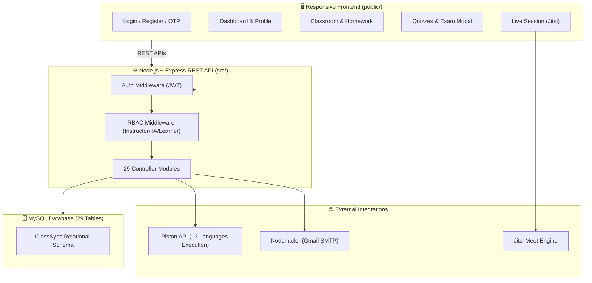

# 🎓 ClassSync — Multi-Tenant Classroom Management & Code Evaluation Platform

[](https://nodejs.org/)
[](https://expressjs.com/)
[](https://www.mysql.com/)
[](#)
[](#)

> **DBMS Lab Project (CSE 3522) — United International University (UIU)**  
> **ClassSync** is an all-in-one, full-stack LMS & competitive learning platform featuring real-time multi-language code evaluation, automated exam grading, plagiarism detection, live video classes, learner risk alerts, and interactive communication.

---

## 🌟 Key Platform Highlights

- ⚡ **Quizzes & Exams Engine:** Live scheduled & flexible window exams supporting MCQs, True/False, and **Automated Coding Questions**.
- 💻 **Multi-Language Student Code Execution (13 Languages):** Powered by Piston API with student-selected programming languages (Python, C++, C, Java, JS, TS, C#, Go, Rust, Ruby, PHP, Kotlin, Swift).
- 🔒 **Multi-Test Cases & Hidden Test Cases:** Teachers set custom test cases with hidden toggles; auto-evaluated upon student submission.
- 🛡️ **Plagiarism Detection System:** Automated source code similarity scanner detecting academic dishonesty across student submissions.
- 📹 **Live Classroom Video Sessions:** Embedded Jitsi Meet video classes with automated duration-based attendance tracking & instructor overrides.
- 📊 **Class Analytics & At-Risk Learner Alerts:** Real-time health metrics, automated Yellow/Red risk flags, and student performance heatmaps.
- 💬 **Messaging & Community:** Scoped group chat, private direct messaging, and learning resource sharing with instructor approval.
- 👤 **Full User Identity & Profile System:** Custom avatars, social link integration (GitHub, LinkedIn, Website), 90-day submission heatmap, and dark/light theme switching.

---

## 🛠️ Technology Stack

| Layer | Technology | Description |
|---|---|---|
| **Backend Framework** | Node.js + Express.js (v4) | Modular REST API server architecture |
| **Database & Driver** | MySQL (8.0+) + `mysql2/promise` | Relational storage with async pooling & dual-write |
| **Authentication & Security** | JWT (jsonwebtoken) + bcrypt | Token auth, password hashing, and RBAC middleware |
| **Email Transporter** | Nodemailer (Gmail SMTP) | OTP email verification for registration & password reset |
| **Code Runner Engine** | Piston API Engine | Remote sandbox execution across 13 programming languages |
| **Video Conferencing** | Embedded Jitsi Meet API | Interactive video classrooms |
| **Frontend UI** | HTML5 + CSS3 + Vanilla JavaScript | Responsive single-page dashboard experience with glassmorphism |

---

## 🏗️ Architecture Overview



---

## 🚀 Quick Setup Guide for Teammates & QA Testers

Follow these steps to run **ClassSync** locally on your machine for testing:

### 1. Prerequisites
- **Node.js** (v18 or higher installed)
- **MySQL Database** (XAMPP MySQL or MySQL Workbench running on port `3306`)

### 2. Clone & Install Dependencies
```bash
git clone https://github.com/see-yaam/ClassSync.git
cd ClassSync
npm install
```

### 3. Environment Configuration
Create a `.env` file in the root directory (or copy `.env.example`):
```env
PORT=3000
DB_HOST=localhost
DB_PORT=3306
DB_USER=root
DB_PASSWORD=
DB_NAME=classsync
JWT_SECRET=classsync_secret_jwt_key_2026
EMAIL_USER=your_email@gmail.com
EMAIL_PASS=your_app_password
```

### 4. Database Setup
Ensure MySQL is running, then initialize the database tables:
```bash
# Option A: Automatic table creation on server startup
npm run dev

# Option B: Manual SQL execution via MySQL Workbench / phpMyAdmin
# Import schema.sql into database named 'classsync'
```

### 5. Launch Application
```bash
npm run dev
```
Open **[http://localhost:3000](http://localhost:3000)** in your browser!

---

## 📖 Complete Feature Walkthrough & Testing Guide

This guide breaks down every feature from both the **Instructor (Teacher) End** and **Learner (Student) End** so your team can test every workflow systematically.

---

### 1. 🔑 Account Registration & OTP Verification
- **Teacher & Student End:**
  1. Go to **Register** page (`/register.html`).
  2. Enter **Full Name**, **Email Address**, **Password**, and select an optional **Profile Picture**.
  3. Click **Send Verification OTP**.
  4. Check your email (or check server console logs for fallback OTP code if SMTP is disabled) and enter the 6-digit OTP code on `/verify-otp.html`.
  5. Account is verified! You can now log in at `/login.html`.

---

### 2. 🏫 Classroom Creation & Enrollment Flow

#### 👨‍🏫 Instructor / Teacher End:
1. Click **+ Create Classroom** on the Dashboard.
2. Fill in:
   - **Classroom Name** & **Description**.
   - **Visibility**: `Public` (discoverable in course search) or `Private`.
   - **Type**: `Free` or `Paid` (Set price in BDT for paid courses).
   - **Attendance Threshold**: e.g., 75% minimum required for passing.
3. System generates a unique **Room Number** & **Room Password**.
4. **Enrollment Request Approval (Paid Courses):**
   - Go to Classroom → **Enrollment Requests** tab.
   - View pending payment submissions (Bkash/Nagad/Rocket transaction IDs).
   - Click **Approve** (adds student as Learner) or **Reject**.

#### 👨‍🎓 Student / Learner End:
1. **Browse Courses:** Explore public courses on the home page or click **Join Classroom**.
2. **Private/Free Course:** Enter **Room Number** & **Room Password** to join instantly.
3. **Paid Course:** Submit payment method (Bkash/Nagad), phone number, and Transaction ID. Request goes into `Pending` status until approved by instructor.

---

### 3. 📝 Homework & Coding Assignments Engine

#### 👨‍🏫 Instructor / Teacher End:
1. Go to Classroom → **Homework** tab → Click **+ Create Homework**.
2. Set **Title**, **Description**, **Points**, **Deadline**, and check **Publish Homework**.
3. **Add Questions:**
   - **Text Question:** Written response or link upload.
   - **Automated Coding Question:**
     - Enter problem prompt.
     - Set starter code template (optional).
     - Add **Test Cases**: Input STDIN data and Expected Output string.
     - Check `🔒 Hidden Test Case` for hidden evaluation cases.
4. **Submission Matrix & Grading:**
   - View all student submissions in a grid matrix.
   - Click student answer to open **Code Review Modal**.
   - Leave line-by-line code review comments, assign marks, and click **Submit Grade**.

#### 👨‍🎓 Student / Learner End:
1. Open Classroom → Click pending **Homework**.
2. View assignment deadline & countdown indicator.
3. For coding questions:
   - Write code solution in the browser editor.
   - View sample visible test cases.
   - Click **Submit Homework**.
4. System automatically runs code through Piston API against test cases and displays score upon teacher approval.

---

### 4. ⚡ Quizzes & Exams System (Live vs Flexible Window)

#### 👨‍🏫 Instructor / Teacher End:
1. Go to Classroom → **Quizzes & Exams** tab → Click **+ Create Quiz/Exam**.
2. Configure Exam Parameters:
   - **Quiz Title** & **Description**.
   - **Exam Type**:
     - ⚡ **Scheduled Live Exam:** Hard start and end time window for all students.
     - ⏱️ **Flexible Window Quiz:** Students can take it anytime within a start/end date range.
   - **Duration**: e.g., 20 minutes countdown timer.
3. **Add Exam Questions:**
   - **MCQ (Multiple Choice):** Add choices, mark the correct option radio button.
   - **True / False:** Select True or False correct answer.
   - **Automated Coding Question:** Add prompt and multiple test cases with optional `🔒 Hidden Test Case` toggle. (Teacher does *not* restrict language).
4. Click **Publish Quiz**. It automatically syncs to the Academic Calendar!

#### 👨‍🎓 Student / Learner End:
1. Open Classroom → Click **Start Exam** (or **Resume Exam** if interrupted).
   - *Note:* If exam start time has not arrived, screen shows a live countdown clock: *"Quiz opens in XX:XX:XX"*.
2. **Taking the Exam:**
   - **Real-Time Countdown Timer:** Persistent top header timer. Time expired triggers auto-submission.
   - **Student Language Selector:** For coding questions, student selects their preferred programming language from **13 options**:
     - Python, C++, C, Java, JavaScript, TypeScript, C#, Go, Rust, Ruby, PHP, Kotlin, Swift.
   - Write code or select MCQ radio buttons. Progress **auto-saves** in real time.
   - Click **Submit Exam**.
3. **Results & Leaderboards:** View score rankings and leaderboard upon approval!

---

### 5. 📹 Live Interactive Classes & Automated Attendance

#### 👨‍🏫 Instructor / Teacher End:
1. Go to Classroom → **Live Sessions** tab → Click **+ Schedule Live Class**.
2. Enter **Session Title**, **Scheduled Date & Time**, and **Expected Duration (mins)**.
3. Click **Start Live Session** when ready. System opens embedded Jitsi Meet video call.
4. **Attendance Tracking:**
   - System automatically tracks join time and leave time for each student.
   - Students meeting the duration threshold (e.g. 75%) are marked **Present**.
   - Instructor can manual override attendance with reason input.

#### 👨‍🎓 Student / Learner End:
1. Navbar displays animated 🔴 **Live Class Alert** button when a class is active.
2. Click **Join Live Class** to join video session inside the platform.

---

### 6. 🕵️ Plagiarism Detection System

#### 👨‍🏫 Instructor / Teacher End:
1. Go to Classroom → **Plagiarism Scanner** tab.
2. Select a homework assignment and click **Run Plagiarism Scan**.
3. Engine performs pairwise n-gram code similarity comparison across all student submissions.
4. Results show:
   - Side-by-side code diff comparison.
   - Similarity Percentage (e.g., 92% match).
   - Flags flagging student pair for review.

---

### 7. 📊 Learner Warning Alerts & Class Health Dashboard

#### 👨‍🏫 Instructor / Teacher End:
1. Go to Classroom → **Analytics & Health** tab.
2. View Class Average, Homework Completion Rate, Attendance Rate, and Submission Heatmap.
3. **Issue Learner Alert:**
   - Select a student.
   - Choose alert level: 🟡 **Yellow Alert** (Warning) or 🔴 **Red Alert** (Critical Risk).
   - Enter alert message (e.g., *"Low assignment submission rate"*).

#### 👨‍🎓 Student / Learner End:
1. Alert badge appears on user's Classroom card and Dashboard header.
2. Shows guidance message on how to improve performance.

---

### 8. 💬 Classroom Chat & Direct Messaging

- **Group Chat:** Real-time scoped classroom chat for announcements and peer discussions.
- **Direct Messaging (DM):** Click any member in Classroom → **Members** tab to send private DMs.

---

### 9. 📚 Resource Sharing & Practice Problems Bank

- **Resource Sharing:** Students and instructors can share links/files. Learner uploads require instructor approval before becoming visible to the class.
- **Problem Bank:** Categorized library of practice problems (Easy, Medium, Hard) with instructor sample solutions.

---

### 10. 👤 Profile Management & Theme Customization

- **Profile Page (`/profile.html`):** Edit Full Name, Email, Bio, Social links (GitHub, LinkedIn, Website), and Change Password.
- **90-Day Submission Heatmap:** Displays daily activity tiles (GitHub-style).
- **Dark / Light Theme:** Click theme toggle in navbar to switch interface themes.

---

## 🧪 Systematic Bug Testing Checklist for Teammates

When testing ClassSync with your team, try testing these scenarios to uncover potential edge cases:

- [ ] **Auth:** Register 2 Teacher accounts and 3 Student accounts using separate browser tabs or Incognito windows.
- [ ] **Enrollment:** Test joining a paid classroom with invalid transaction ID, then approve it from instructor end.
- [ ] **Quiz Timer:** Start a quiz, refresh the browser page mid-way, and verify timer and answers persist accurately.
- [ ] **Multi-Language Code Runner:** Submit Python code, C++ code, and Java code for the same exam question to verify Piston API evaluation.
- [ ] **Hidden Test Cases:** Ensure students cannot see `is_hidden = true` test cases in exam interface, but their score reflects hidden test case evaluation.
- [ ] **Live Attendance:** Join a live class, leave after 1 minute, and check if attendance status correctly reflects duration threshold.
- [ ] **Plagiarism:** Submit identical code from two student accounts and trigger Plagiarism Scan.

---

## 📁 Repository Directory Structure

```
ClassSync/
├── .env.example                  # Template for environment configuration
├── package.json                  # Dependencies & scripts
├── schema.sql                    # Full MySQL Database schema (29 tables)
│
├── src/                          # Backend Source Code
│   ├── server.js                 # Express server & background jobs
│   ├── config/db.js              # MySQL connection pool & dual-write handler
│   ├── middleware/               # Auth (verifyToken, optionalToken) & RBAC middleware
│   ├── controllers/              # 29 Controller modules handling business logic
│   ├── routes/                   # 29 Route definition files
│   └── utils/                    # Mailer, Piston API wrapper, helpers
│
└── public/                       # Frontend Assets & Pages
    ├── index.html                # Main Dashboard
    ├── login.html / register.html# Auth pages
    ├── classroom.html            # Classroom Hub (Tabs: HW, Quizzes, Members, Chat, Analytics)
    ├── homework.html             # Assignment Editor & Code Submission
    ├── leaderboard.html          # Leaderboards & Analytics
    ├── live.html                 # Video Classrooms
    ├── css/style.css             # Unified styling system
    └── js/                       # Modular frontend JavaScript handlers
```

---

## 🤝 Contributing & License

Developed for **CSE 3522 (DBMS Lab)** at **United International University (UIU)**.  
Licensed under the **MIT License**.
